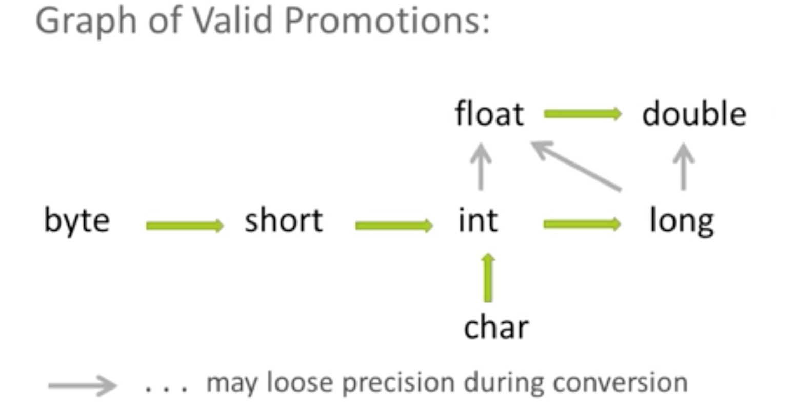

# Method Overloading

Methods within the same class, with the same name, but must have different parameter lists...
  ________________
ex:
(perfectly fine) 

```
public void getX() {  
    ...   

    ...    
}
public String getX(int x) {  
    return ...

    ...
}
```


ex:(won't compile)

```
public Int setX(int x) {  
    ...

    ...
}
public String setX(int x) {  
    return ...

    ...
}
```


# Promotion and Casting
________________
## Promotion  
#### -float can be promoted to double  
#### -long can be promoted to double and float  
#### -int can be promoted to double and float and long  
#### etc...   
  
  

## Casting  
#### can do the opposite of Promotion, but need to explicitly say what type the new value will be

ex:
```
long l = 14L;

int i = l;
```
WILL NOT WORK

Must use casting
```
long l = 14L;

int i = (int)l;
```